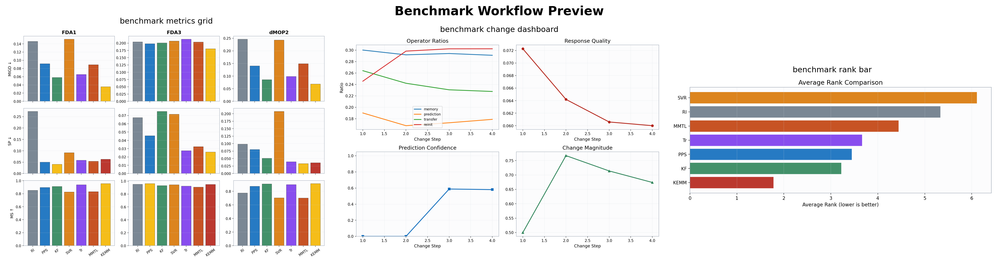
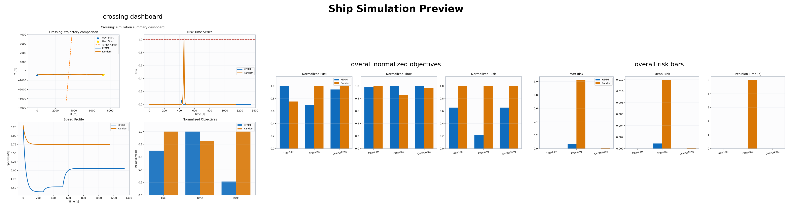

# KEMM: Dynamic Multi-Objective Optimization + Ship Trajectory Simulation

一个面向研究工作的 Python 项目，统一维护两条主线：

1. `benchmark` 主线
   使用动态多目标标准测试问题验证 KEMM 与多种基线算法。
2. `ship_simulation` 主线
   使用纯代码生成的偏现实船舶会遇场景，验证 KEMM 在物理语义轨迹规划问题上的效果。

本仓库的目标不是做单次实验脚本，而是提供一个可维护、可复现、可扩展、可继续演化的研究型代码库。

---

## 1. 项目亮点

- **约束支配排序 (CDNSGA - Constrained Domination)**：原生融合 Deb 的可行性规则 (Feasibility Rules)，将碰撞和边界惩罚彻底解耦至独立的约束标量 (CV)，极大保护了目标空间帕累托前沿的纯粹性，满足顶刊对物理语义优化的严格要求。
- **纯粹的上下文多臂老虎机 (Contextual MAB - UCB1)**：摒弃传统魔法参调控，基于环境漂移强度 (`change_magnitude`) 构建多状态桶 Contextual Bandits，完全通过统计学 UCB 自治收敛算子最佳分配策略。
- **双主线统一**：benchmark 理论验证 + ship 物理语义滚动验证。
- **benchmark 主线**：已补齐 `MIGD` 主表、四大核心自适应进化模块 (Memory/Predict/Transfer/Reinit) 消融与兼容比较。
- **ship 仿真主线**：集成滚动避碰重规划 (Episodes)，涵盖单/多船相遇、静态岛礁/高密障碍物受限区、COLREG规则与任意动态环境矢量场。
- **极其严苛的模块解耦与出图**：报告层、算法内核明确剥离。内置基于 SciencePlots/IEEE 的多场景三维、时序、流场映射与解集轨迹的可视化和交互分析。
- 文档体系同时面向：GitHub 访客、新开发者、新 AI 助手、论文写作 (涵盖详尽命令备忘与架构审视)。

---

## 2. 仓库示例图

### 2.1 Benchmark 结果预览



### 2.2 Ship 仿真结果预览



---

## 3. 仓库结构

```text
.
├── AGENTS.md
├── README.md
├── reporting_config.py
├── requirements.txt
├── requirements-dev.txt
├── docs/
│   ├── ai_developer_handoff.md
│   ├── codebase_reference.md
│   ├── environment_setup.md
│   ├── figure_catalog.md
│   ├── formula_audit.md
│   ├── how_to_run.md
│   ├── kemm_reference.md
│   ├── run_commands.md
│   ├── ship_experiment_playbook.md
│   ├── ship_simulation_reference.md
│   ├── visualization_guide.md
│   └── images/
├── apps/
│   ├── benchmark_runner.py
│   ├── ship_runner.py
│   └── reporting/
├── kemm/
├── ship_simulation/
├── tests/
├── run_experiments.py
├── benchmark_algorithms.py
└── visualization.py
```

---

## 4. 真实实现与兼容层

### 4.1 真实实现

优先关注这些文件和目录：

- `apps/benchmark_runner.py`
- `apps/ship_runner.py`
- `apps/reporting/benchmark_visualization.py`
- `kemm/algorithms/*`
- `kemm/adapters/*`
- `kemm/benchmark/*`
- `kemm/core/*`
- `kemm/reporting/*`
- `ship_simulation/*`
- `reporting_config.py`

### 4.2 兼容层

这些文件主要用于保留旧导入路径和旧命令，不应作为新逻辑的首选落点：

- `run_experiments.py`
- `benchmark_algorithms.py`
- `visualization.py`
- `adaptive_operator.py`
- `compressed_memory.py`
- `geodesic_flow.py`
- `pareto_drift.py`

---

## 5. 环境与安装

推荐 Python 版本：`3.10` 到 `3.12`，兼容目标 `3.9+`。

```powershell
python -m venv .venv
.venv\Scripts\Activate.ps1
pip install -U pip
pip install -r requirements.txt
```

如果需要运行测试：

```powershell
pip install -r requirements-dev.txt
```

更详细环境说明见：

- [docs/environment_setup.md](docs/environment_setup.md)
- [docs/how_to_run.md](docs/how_to_run.md)
- [docs/ship_experiment_playbook.md](docs/ship_experiment_playbook.md)

---

## 6. 快速开始

如果你以后忘了命令，优先看：

- [docs/how_to_run.md](docs/how_to_run.md)

如果你只记主运行入口，只记下面这两条：

```powershell
python -m apps.benchmark_runner --full --workers 4
python ship_simulation/run_report.py --workers 4
```

- `python -m apps.benchmark_runner --full --workers 4`：跑完整 benchmark，保持当前标准协议不缩水，包括 6 个问题、5 次重复、消融和全部图表。
- `python ship_simulation/run_report.py --workers 4`：跑完整 ship 报告，保持 4 个场景 × 3 个算法 × 3 次重复，并完整生成 78 张图。
- 其它 quick、interactive、plot preset 和临时 profile 组合不再在 README 展开，统一看 [docs/how_to_run.md](docs/how_to_run.md) 和 [docs/run_commands.md](docs/run_commands.md)。

### 6.1 为什么完整实验仍然慢

完整实验依然慢，是因为协议没有缩水，而不是因为入口变复杂了。

benchmark 这条线仍然要覆盖完整问题集、重复运行、消融和全图表。本轮主要做了实现层提速：

- 新增任务级缓存，粒度固定为 `(setting, algorithm, problem, run, ablation_variant)`；同配置重跑时默认直接复用结果。
- 真实 POF 序列和时间变量按 `(setting, problem, change_index)` 预计算复用，减少重复 `pof_func()` 调用。
- 只有 canonical setting 继续保留完整 `curve + change_diagnostics` 聚合；非 canonical setting 只保留最终标量指标，报告口径不变。
- 如需强制跳过缓存，可在 benchmark 入口上追加 `--force-rerun`。

ship 这条线仍然慢，是因为完整模式依然要先算完 36 个 episode，再渲染 78 张图。本轮主要加速了三层：

- 环境场、domain risk、DCPA/TCPA 和障碍净空改成整条轨迹批量计算，减少逐时刻 Python 分派。
- 完整报告内部改成“episode 计算/缓存 -> 图表并行渲染 -> summary/metadata”三阶段，外部命令仍保持一步到位。
- 同配置再次运行时，默认复用 `raw/episode_cache/` 下的 episode 结果，只重新生成图表与汇总。

### 6.2 Ship 默认 profile

完整 ship 报告现在默认使用 `full_tuned` 场景 profile。它会按 `head_on / crossing / overtaking / harbor_clutter` 分别分配求解预算、滚动时域、净空阈值和风险权重，目标是在不改 KEMM 核心机制的前提下，让完整实验更快、ship 结果更稳。

旧的统一预算仍保留为 `legacy_uniform`，用于回归比较。完整报告的 summary 和 metadata 会明确写出当前 active profile，以及 `episode_compute_seconds`、`figure_render_seconds`、`episode_cache_hits`、`episode_cache_misses`。

### 6.3 验证入口

基础测试和 smoke 命令保留在 [AGENTS.md](AGENTS.md) 与 [docs/how_to_run.md](docs/how_to_run.md)，README 不再展开更多运行分支。

### 6.4 快速验证算法逻辑

如果你现在不是要跑完整实验，只是想确认“当前算法逻辑能不能走通”，优先用下面三条：

```powershell
python -m apps.benchmark_runner --quick --force-rerun --algorithms KEMM --problems FDA1
python ship_simulation/run_report.py --quick --scenarios crossing --n-runs 1 --algorithms kemm --summary-only
python -m unittest discover -s tests -v
```

如果你想顺带验证 ship 最新报告结构（严格可比 + 统计 + 鲁棒性）链路，再补一条：

```powershell
python ship_simulation/run_report.py --quick --summary-only --scenarios crossing --n-runs 1 --algorithms kemm random --strict-comparable --robustness-sweep --robustness-levels 0,0.5 --robustness-scenarios crossing
```

它们分别适合：

- `python -m apps.benchmark_runner --quick --force-rerun --algorithms KEMM --problems FDA1`
  - 最小 benchmark 冒烟验证
  - 走真实入口
  - 强制跳过缓存
  - 只跑 `KEMM + FDA1`
- `python ship_simulation/run_report.py --quick --scenarios crossing --n-runs 1 --algorithms kemm --summary-only`
  - 最小 ship 冒烟验证
  - 只跑一个场景、一种算法、一次重复
  - 跳过图表渲染，更快暴露 solver / episode / selection 链路问题
- `python -m unittest discover -s tests -v`
  - 基础单元测试和回归测试

实用判断规则：

- 改了 `kemm/`、benchmark 响应逻辑或 benchmark 指标：先跑第一条
- 改了 `ship_simulation/optimizer/*`、风险模型、场景生成或 episode：先跑第二条
- 准备提交前：再补跑第三条

---

## 7. 输出目录约定

### 7.1 benchmark

```text
benchmark_outputs/
└── benchmark_YYYYMMDD_HHMMSS/
    ├── figures/
    ├── raw/
    └── reports/
```

### 7.2 ship

```text
ship_simulation/outputs/
└── report_YYYYMMDD_HHMMSS/
    ├── figures/
    ├── raw/
    └── reports/
```

两条主线保持统一输出结构，便于归档、写论文和批量分析。

---

## 8. Ship 主线现在做了什么

ship 主线已经不是单次静态规划 demo，而是：

- 近海增强场景：对遇、交叉、追越、高密障碍受限海域穿越
- 静态障碍：岛礁、禁航区、水道边界
- 动态交通体：多目标船
- 环境层：标量风险场 + 矢量流场
- 风险模型：船舶域 + DCPA/TCPA + 障碍侵入 + 环境暴露
- 执行方式：滚动重规划 episode
- 输出结果：最终执行轨迹、每步局部前沿、knee point、快照、控制时序、统计指标

当前更准确的算法架构口径是：

- `kemm/` 提供通用动态多目标响应骨架
- `ship_simulation/optimizer/problem.py` 把船舶规划写成 `fuel / time / risk` 三目标问题
- `ship_simulation/optimizer/kemm_solver.py` 在 KEMM 候选生成链外，再注入场景感知绕行初始候选
- `ship_simulation/optimizer/selection.py` 用“安全优先 -> 终点推进 -> 折中得分”的规则选代表轨迹
- `episode.py` 把单次优化连接成滚动重规划闭环

这里最关键的实现细节有两个：

- `risk` 目标现在主要表达沿轨迹的真实安全暴露，不再把 terminal progress 直接并进风险维
- `cv` 现在主要表达 `越界 + 净距不足/侵入 + 风险侵入时间` 这类约束违背，而不是把终端推进不足也混进去

核心代码位置：

- 场景：`ship_simulation/scenario/*`
- 问题定义：`ship_simulation/optimizer/problem.py`
- episode 执行层：`ship_simulation/optimizer/episode.py`
- KEMM 适配：`ship_simulation/optimizer/kemm_solver.py`
- NSGA-style 基线：`ship_simulation/optimizer/baseline_solver.py`
- 报告图：`ship_simulation/visualization/report_plots.py`

---

## 9. 可视化与论文图包

图表系统分三层：

1. 公共风格配置层：`reporting_config.py`
2. benchmark 图表层：`apps/reporting/benchmark_visualization.py`
3. ship 图表层：`ship_simulation/visualization/report_plots.py`

当前推荐的 ship 论文图包包括：

- 多场景环境总览图
- 多场景最终轨迹带对比图
- 环境场/矢量场叠加轨迹图
- 高密障碍海域路线规划主图
- 动态避碰时空快照图
- 3D 时空轨迹图
- 动力学/控制多子图时序图
- 3D Pareto Front + Knee Point
- 2D Pareto 投影前沿曲线组
- 风险分解时间序列图
- 安全包络图
- Parallel Coordinates
- Radar Chart
- 带阴影误差带的收敛曲线
- Violin Plot
- repeated-run 安全统计图
- Summary dashboard
- 求解时间与控制能耗折中图
- 决策空间 PCA 投影视图
- Contextual MAB 算子动态分配图

如果你想让输出图不只是固定 PNG，而是可以后续继续交互：

交互式 figure bundle、HTML 导出和 `figure_viewer` 的使用方式不再在 README 展开命令组合，统一见：

- [docs/visualization_guide.md](docs/visualization_guide.md)
- [docs/figure_catalog.md](docs/figure_catalog.md)

如果你想快速切换不同论文风格，优先看 [docs/how_to_run.md](docs/how_to_run.md)。当前仓库常用的 preset 仍然是：

- `paper`：默认论文风格，适合日常出图与仓库展示
- `ieee`：更紧凑，适合 IEEE 类版式
- `nature`：更强调视觉展示
- `thesis`：不强依赖 SciencePlots，适合长文档或毕业论文

如果你想统一修改 ship 图的视觉主题，优先改 [reporting_config.py](reporting_config.py) 里的 `ShipPlotConfig`。现在颜色、卡片、图例和底图强度都已经集中到这一处，不需要再去每个绘图函数里找硬编码。最常改的是：

- `own_ship_color / baseline_color / third_algo_color`
- `start_marker_color / goal_marker_color / traffic_marker_color`
- `panel_facecolor / legend_facecolor / legend_edgecolor`
- `card_facecolor / card_edgecolor / card_alpha`
- `scalar_field_floor_quantile / scalar_field_alpha / vector_field_alpha`
- `dashboard_width_ratios / dashboard_height_ratios`

如果你想直接改 ship 场景生成参数，优先改：

- `ship_simulation/config.py` 里的 `ProblemConfig.scenario_generation`

例如：

```python
from ship_simulation.config import build_default_config

config = build_default_config()
config.scenario_generation.harbor_clutter.circular_obstacle_limit = 5
config.scenario_generation.harbor_clutter.polygon_obstacle_limit = 2
config.scenario_generation.harbor_clutter.target_limit = 2
config.scenario_generation.harbor_clutter.circular_radius_scale = 0.55
config.scenario_generation.harbor_clutter.channel_width_scale = 1.20
```

这组参数会直接影响 `harbor_clutter` 的障碍数量、障碍尺度、目标船数量和通航窗口宽度。

如果你想把场景改成“同一 family 下的可重复变体”，现在也不用回到 `generator.py` 里改硬编码。优先改：

- `family_name`
- `scenario_seed`
- `difficulty_scale`
- `geometry_jitter_m`
- `traffic_heading_jitter_deg`
- `current_direction_jitter_deg`

例如：

```python
config.scenario_generation.crossing.family_name = "crossing_family_a"
config.scenario_generation.crossing.scenario_seed = 17
config.scenario_generation.crossing.difficulty_scale = 1.20
config.scenario_generation.crossing.geometry_jitter_m = 120.0
config.scenario_generation.crossing.traffic_heading_jitter_deg = 6.0
config.scenario_generation.crossing.current_direction_jitter_deg = 8.0
```

这样生成的场景仍然保持 `crossing` 的语义，但会输出同 family 的可复现实验变体；对应 seed 和 family 会写进 `scenario_catalog.json`。

ship 现在有两套互相独立、但经常同时出现的 profile 体系：

1. `ProblemConfig.experiment`
   - 控制滚动重规划过程里的计划变化事件
   - 例如环境漂移、交通意图偏移和临时 closure 注入
2. `DemoConfig.scenario_profiles`
   - 控制不同场景的求解预算、局部时域、净空阈值和风险权重
   - 完整报告默认用 `full_tuned`
   - quick 模式默认退回 `legacy_uniform`

如果你想直接启用面向 KEMM 机制验证的动态 experiment profile，优先改：

- `ship_simulation/config.py` 里的 `ProblemConfig.experiment`

例如：

```python
from ship_simulation.config import apply_experiment_profile, build_default_config

config = build_default_config()
apply_experiment_profile(config, "shock")
```

当前内置 profile：

- `baseline`
- `drift`
- `shock`
- `recurring_harbor`

这些 profile 会直接影响滚动重规划过程中的环境漂移、目标船意图变化和通道 closure 扰动；对应的解释图是每个场景新增的 `*_change_timeline.png`。

如果开启 `--robustness-sweep`，还会额外导出 `figures/robustness_success_curve.png` 与配套 `raw/robustness_*.csv/json`，用于展示扰动强度扫描下的成功率曲线。

如果你想切换场景预算 profile，优先改：

- `ship_simulation/config.py` 里的 `DemoConfig.scenario_profiles.active_profile_name`

例如：

```python
from ship_simulation.config import build_default_demo_config

demo = build_default_demo_config()
demo.scenario_profiles.active_profile_name = "legacy_uniform"
```

当前 `full_tuned` 会按 `head_on / crossing / overtaking / harbor_clutter` 分别调整：

- `random_search_samples`
- `evolutionary_baseline_pop_size / generations`
- `kemm_pop_size / generations`
- `kemm_initial_guess_copies`
- `kemm_heuristic_detour_limit`
- `kemm_reuse_solver_state`
- `local_horizon / execution_horizon / max_replans`
- `objective_weights`
- `safety_clearance`
- `soft/hard clearance penalties`
- `time/risk safety penalty weights`
- `domain_risk_weight`

完整 ship 报告的 summary 和 metadata 会明确写出当前 active solve profile，以及 `episode_compute_seconds`、`figure_render_seconds`、`episode_cache_hits`、`episode_cache_misses`。

如果你想直接调 ship 侧 KEMM 的真实机制开关和预算，优先改：

- `ship_simulation/config.py` 里的 `DemoConfig.kemm`
- `ship_simulation/config.py` 里的 `DemoConfig.kemm.runtime`

其中：

- `DemoConfig.kemm.pop_size / generations / seed` 控制 ship 侧运行预算
- `DemoConfig.kemm.use_change_response` 控制滚动重规划时是否调用 KEMM 的 change response
- `DemoConfig.kemm.runtime.enable_memory / enable_prediction / enable_transfer / enable_adaptive` 对应真实 KEMM 模块开关
- `DemoConfig.kemm.inject_heuristic_detours / heuristic_detour_limit / heuristic_detour_offset_scale` 控制场景感知绕行初值是否注入、注入多少以及横向偏移尺度

例如：

```python
from ship_simulation.config import build_default_demo_config

demo = build_default_demo_config()
demo.kemm.generations = 28
demo.kemm.use_change_response = True
demo.kemm.runtime.enable_prediction = True
demo.kemm.runtime.enable_transfer = False
```

当前 ship 主线里，同一个 episode 内会复用同一个 KEMM 求解器 session，而不是每个 replanning step 都重新新建算法对象。这意味着 `memory / prediction / transfer / adaptive` 的状态会沿滚动重规划继续积累，更接近真正的动态优化语义。

如果你想调整 ship 报告里到底比较哪些算法，优先改：

- `ship_simulation/config.py` 里的 `DemoConfig.report_algorithms`

例如：

```python
demo = build_default_demo_config()
demo.report_algorithms = ("kemm", "random")
```

完整报告的内部执行顺序现在是：

1. 先求解全部 episode
2. 把 episode 结果写入 `raw/episode_cache/`
3. 再并行渲染图表
4. 最后写 `summary / metadata / inventory`

报告原始目录还会额外导出：

- `raw/figure_manifest.json`
- `raw/representative_runs.json`
- `raw/report_metadata.json`
- `raw/planning_steps.json`
- `raw/scenario_catalog.json`
- `raw/statistical_tests.json`
- `raw/statistical_tests.csv`
- `raw/robustness_summary.json`（启用扰动扫描时）

其中：

- `figure_manifest.json` 说明默认理论导出了哪些图
- `representative_runs.json` 记录每个场景、每个算法被选中的代表性 run
- `report_metadata.json` 记录当前 experiment profile、solve profile、缓存命中和分阶段耗时
- `planning_steps.json` 记录逐 step 的局部解、变更注入和 runtime
- `scenario_catalog.json` 记录 family、seed、difficulty 和场景对象计数
- `statistical_tests.*` 记录 `KEMM` 与 baseline 在各场景指标上的 95% CI 与显著性检验结果
- `robustness_summary.json` 记录扰动强度扫描下的成功率曲线

当前 summary 表和 CSV 统计的是全部 repeated runs，而路线、时空轨迹、风险分解这类图仍然使用 representative run。后面写论文时，优先把这层区别说清楚。

它们和 `reports/figure_inventory.md` 由同一套 figure registry 自动生成。后面如果继续加图，优先在这套 registry 上扩，不要再手工同步多个列表。

---

## 10. 改算法时应该改哪里

- 改 KEMM 主流程：`kemm/algorithms/kemm.py`
- 改 benchmark-only prior：`kemm/adapters/benchmark.py`
- 改 KEMM 子模块：`kemm/core/*.py`
- 改 ship 问题定义：`ship_simulation/optimizer/problem.py`
- 改 ship episode：`ship_simulation/optimizer/episode.py`
- 改图表风格：`reporting_config.py`
- 改 ship 论文图：`ship_simulation/visualization/report_plots.py`
- 改 benchmark 图：`apps/reporting/benchmark_visualization.py`

不要优先改根目录 legacy 文件。

---

## 11. 文档索引

### 总览 / 架构

- [AGENTS.md](AGENTS.md)
- [docs/codebase_reference.md](docs/codebase_reference.md)
- [docs/ai_developer_handoff.md](docs/ai_developer_handoff.md)
- [docs/how_to_run.md](docs/how_to_run.md)

### KEMM 主线

- [docs/kemm_reference.md](docs/kemm_reference.md)
- [docs/formula_audit.md](docs/formula_audit.md)

### Ship 主线

- [docs/ship_simulation_reference.md](docs/ship_simulation_reference.md)
- [docs/ship_experiment_playbook.md](docs/ship_experiment_playbook.md)

### 图表与论文写作

- [docs/visualization_guide.md](docs/visualization_guide.md)
- [docs/figure_catalog.md](docs/figure_catalog.md)

---

## 12. 当前已知说明

- `SciencePlots` 是可选依赖；未安装时会自动回退到内置 matplotlib 风格。
- Windows 下运行 benchmark 或 ship 报告时，末尾可能仍出现 `joblib/loky -> wmic` 的环境警告，但一般不影响结果生成。
- ship 主线当前仍是增强 Nomoto，而不是 MMG；偏现实性来自场景、风险建模、环境层和滚动重规划，而不是高保真水动力学本体。
- benchmark 消融图 `benchmark_ablation.png` 的纵轴是“相对 `KEMM-Full` 的 MIGD 退化百分比”，正值表示删掉模块后性能变差，不是性能提升。
- 如果你看到某份旧 benchmark 报告里 `FDA1` 与 `dMOP3` 的数值整行相同，那是修复前的过期结果；当前代码已经修正 `dMOP3` 的问题定义，旧结果不应继续引用。
